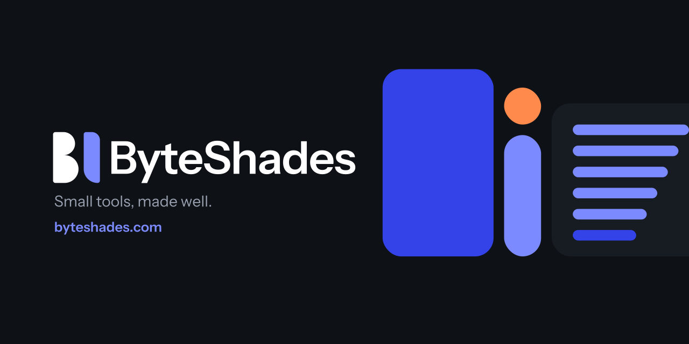

  

**ByteShades is an independent software studio that builds and maintains small tools: browser extensions, Mac apps, developer tools and everyday utilities.**

Each tool does one job, states its price before you install it, and is looked after by the two people who
built it.

### Products

| Product | What it does | Platform | Pricing | Status |
| --- | --- | --- | --- | --- |
| **FeedKeeper** | Hides the YouTube videos you don't want. Keeps the ones you came for. | Chrome extension | Free with your own API key; subscription planned | Beta |
| **[Kolkata Gold Price](https://kolkatagoldprice.com)** | Recorded 18K, 22K and 24K gold rates for Kolkata, in English and Bengali. | Web | Free | Live |

Every product, with its changelog, is on [byteshades.com](https://byteshades.com).

### Team

- **Soumen Samanta**, Co-Founder & CEO · [LinkedIn](https://www.linkedin.com/in/soumen-samanta/)
- **Souvik Samanta**, Co-Founder & CTO · [LinkedIn](https://www.linkedin.com/in/souvik3103/)

### Get in touch

Bug reports, feature requests or a tool you wish existed: [byteshades@gmail.com](mailto:byteshades@gmail.com)

Kolkata, India · One byte, many shades.
